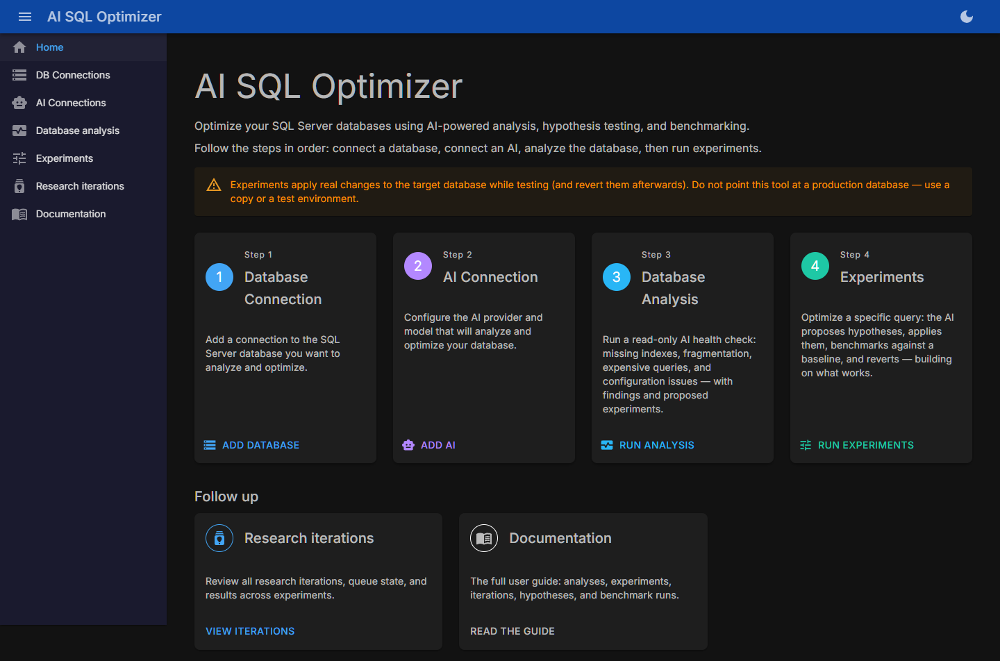
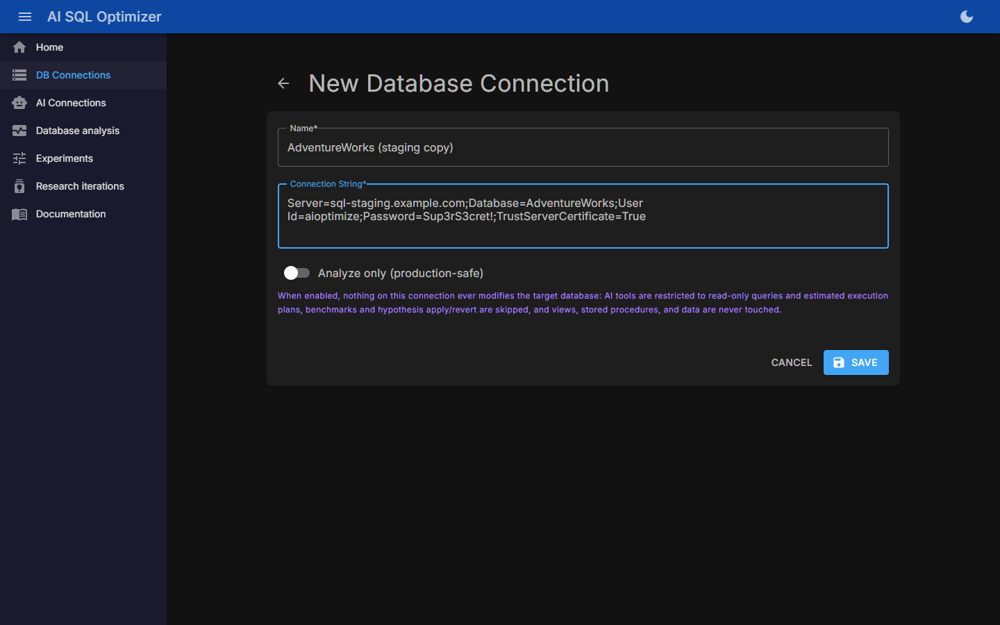
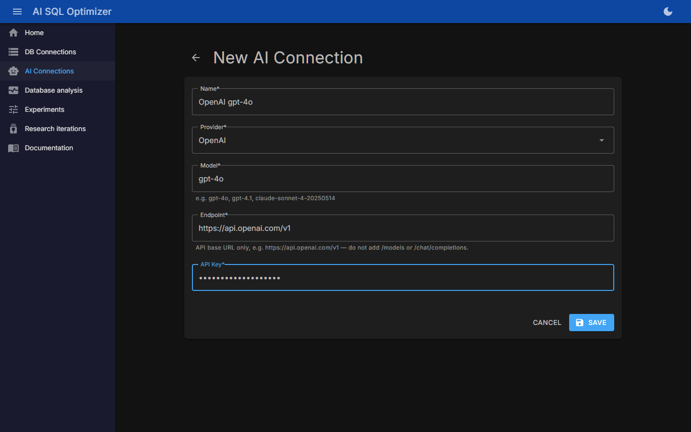
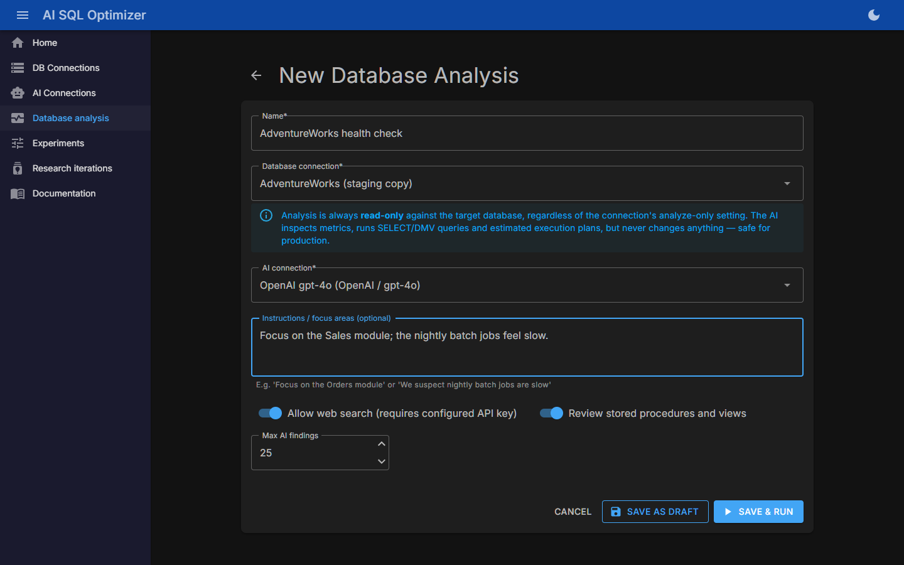
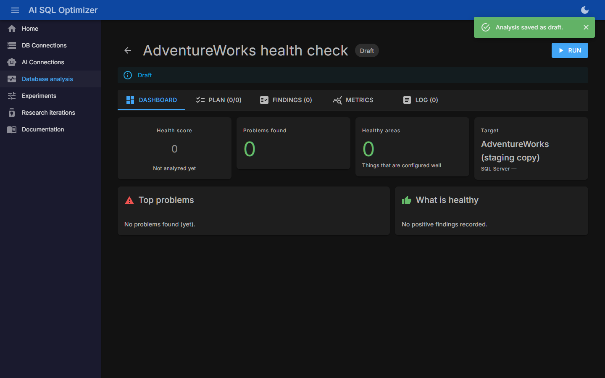
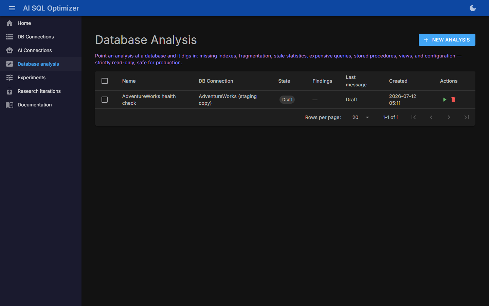
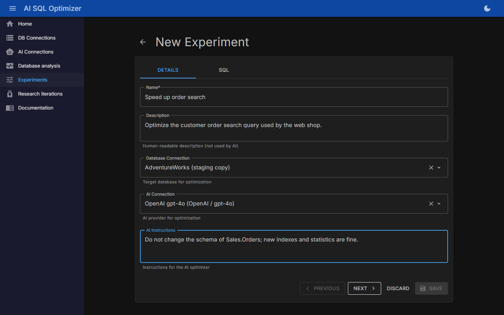
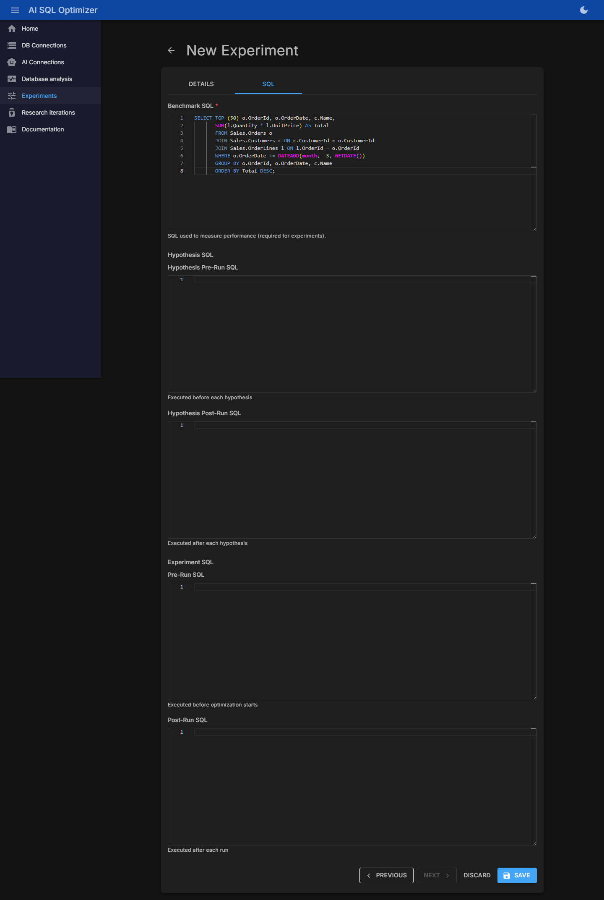
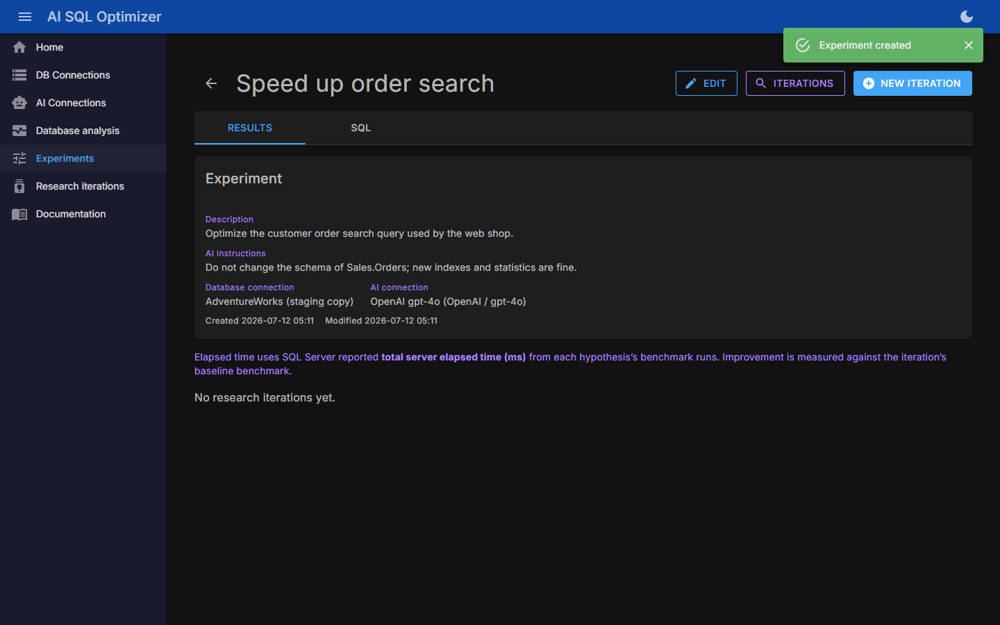
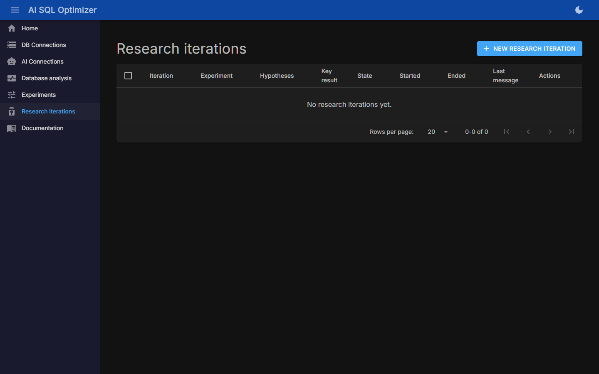

# Tedd.AIOptimizeSql

AI-powered automatic analysis and optimization of SQL Server databases.

---

## Before you connect a database

AIOptimizeSql is genuinely useful — it finds real problems and proves out real fixes. It's also an AI that writes and executes SQL against your database, so it needs to be run responsibly:

- **Use a read-only user for analysis.** Database analysis only ever needs `SELECT` and DMV access. Point it at an account without write permissions and the AI physically cannot change anything, no matter what it decides to try.
- **Use a disposable database for experiments.** Experiments apply real schema changes (indexes, statistics, whatever the AI proposes), benchmark them, and revert them — that revert is best-effort, not guaranteed. Run experiments against a restored backup, a staging copy, or a dev box, not anything you'd miss.
- **Don't run either mode against production.** Even in read-only mode, a slow or unexpected query from the analysis can add load you didn't plan for.

> **Disclaimer:** the author is not responsible for anything this application may do, including if it damages a database you pointed it at — regardless of which mode was selected. See [LICENSE.md](LICENSE.md); there is no warranty. Follow the guidance above and you'll be fine; skip it and you're on your own.

---

## What it does

AIOptimizeSql uses AI to make SQL Server databases faster, in three ways:

**Automatic analysis.** Point it at a database and it runs a broad health check: missing indexes, index fragmentation, stale statistics, expensive queries, wait statistics, stored procedures, views, and configuration. Deterministic rule-based checks run first, then the AI builds its own investigation plan, digs through the metrics and schema, and produces findings with severity, evidence, recommendations, suggested SQL, and an executive summary. Analysis is read-only against the target database.

**Automatic experiments.** Analysis findings can include a **proposed experiment** — a ready-made, pre-filled experiment for testing that recommendation for real. One click turns "the AI thinks this index would help" into "the AI proved this index makes the query 63% faster, here are the numbers."

**Your own experiments.** Already know which query is slow? Create an experiment around it yourself: give it the benchmark SQL, pick a database and an AI, and let it run.

### How experiments work

Experiments are the core idea: instead of an AI *guessing* what might help, it **tests hypotheses against the real database and measures**:

1. **Schema discovery** — the tool maps the tables, indexes, statistics, and dependencies relevant to your benchmark query.
2. **Baseline benchmark** — the query is measured before any changes. Every hypothesis is compared against this.
3. **Hypothesis loop** — the AI proposes a concrete optimization (a *hypothesis*, e.g. *"a covering index on `Orders (CustomerId) INCLUDE (Total)` will speed this up"*), writes the SQL to apply it and the SQL to revert it, applies it, benchmarks it, and reverts it.
4. **Building on what works** — later hypotheses can be applied on top of earlier successful ones, forming chains of compounding optimizations. What worked is kept as the foundation; what regressed is discarded. The result progressively improves instead of being a bag of one-shot guesses.
5. **Data integrity check** — checksums over the involved tables verify the optimizations didn't silently change query results.

Every hypothesis records its improvement percentage, before/after benchmark runs (timings, logical reads, execution plans), the exact SQL used, and the AI's full reasoning log. All of it runs in a background worker — queue work, come back later.

---

## Using the app, step by step

The home page walks you through the flow: connect a database, connect an AI, analyze, experiment.



### Step 1 — Add a database connection

**DB Connections → New.** Name it and paste a SQL Server connection string. The account needs to read system views (DMVs), and — for experiments — create/drop indexes and other objects.

The **Analyze only (production-safe)** switch restricts the connection to read-only queries and estimated execution plans: no benchmarks, no hypothesis apply/revert, no touching data. (Re-read the disclaimer above before trusting any switch with production.)



### Step 2 — Add an AI connection

**AI Connections → New.** Pick a provider (OpenAI, Azure OpenAI, Anthropic, Ollama, or a local endpoint), a model, the endpoint URL, and your API key. You can add several — e.g. a cheap model for routine work and a strong one for hard problems — and choose per analysis/experiment.



### Step 3 — Run a database analysis

**Database analysis → New Analysis.** Pick the database and AI connection, optionally give focus areas ("the nightly batch jobs feel slow"), and hit **Save & Run**. The worker snapshots metrics, runs rule-based checks, lets the AI do its deep dive, and writes an executive summary.



Results land in a dashboard with a health score, problem counts, findings (each with severity, evidence, recommendation, and often suggested SQL — never executed automatically), the AI's live work plan, raw metrics, and a full log. Findings may include **proposed experiments** you can open and run directly.



The list page shows every analysis with its state and finding counts:



### Step 4 — Run experiments

**Experiments → New.** On the **Details** tab: name, database connection, AI connection, and optional AI instructions — use these to fence the AI in ("do not change the schema of Sales.Orders").



On the **SQL** tab, provide the **Benchmark SQL** — the query you want faster. This is what every hypothesis is measured against, so make it representative (realistic parameters, enough executions for stable numbers). Optional pre/post-run SQL hooks run around the whole experiment or around each hypothesis (e.g. clearing caches so measurements are comparable).



Save, then start a **research iteration** — one batch of AI optimization attempts. You can pass per-iteration hints ("the previous index attempt regressed, try join order instead"). The viewer shows iterations, hypotheses, improvements, and benchmark details as they happen:



The **Research iterations** page tracks queue state and results across all experiments:



The built-in **Documentation** page covers all of this in more depth — hypothesis lifecycle, benchmark runs, integrity checks, and troubleshooting tips.

---

## Running standalone (local, SQLite)

The standalone build is a single self-contained executable — no .NET runtime, no database server. It stores its own state in a local SQLite file. (The SQL Server databases you *optimize* are separate and configured inside the app.)

**Download:** grab the latest binary for your OS from the [Releases page](https://github.com/tedd/Tedd.AIOptimizeSql/releases) — `AIOptimizeSql-<version>-win-x64.exe`, or the `linux-x64` / `osx-arm64` tarballs.

**Or build it yourself:**

```powershell
./publish-standalone.ps1        # or -Runtime linux-x64 / osx-arm64
```

**Run it.** Double-click or start from a terminal. On first start it creates a SQLite database at `%LocalAppData%\Tedd.AIOptimizeSql\aioptimize.db` (Linux/macOS: `~/.local/share/Tedd.AIOptimizeSql/`), applies migrations, listens on `http://127.0.0.1:5000` (loopback only — nothing outside your machine can reach it, and no login is required), and opens your browser.

**Configure (optional).** Drop an `appsettings.json` next to the executable:

```json
{
  "Urls": "http://localhost:8080",
  "LaunchBrowser": true,
  "ConnectionStrings": {
    "AIOptimizeDb": "Data Source=my-data.db"
  }
}
```

Environment variables and command-line arguments override the file (`--Urls http://localhost:8080`, `LaunchBrowser=false`, …). To expose the standalone app beyond your own machine, bind a non-loopback address **and** turn on the built-in login (`Security:Authentication:Mode=Enabled` plus a username/password); an IP allowlist is also available. Full configuration and security reference in [docs/DEPLOYMENT.md](docs/DEPLOYMENT.md).

## Deploying to Azure (App Service + Azure SQL)

For team use or always-on operation, run it as an Azure App Service with Azure SQL / SQL Server as the metadata store. The web app hosts the optimize engine in-process, so a single App Service runs everything — use **Basic tier or higher** with **Always On**, since the engine polls for queued work.

```bash
RG=aioptimize-rg
PLAN=aioptimize-plan
APP=aioptimize-web          # must be globally unique
SQLSRV=aioptimize-sql       # must be globally unique

az group create -n $RG -l westeurope
az appservice plan create -g $RG -n $PLAN --sku B1 --is-linux

# Azure SQL for the metadata database
az sql server create -g $RG -n $SQLSRV -u aioptadmin -p '<strong-password>'
az sql db create -g $RG -s $SQLSRV -n AIOptimizeSql --service-objective S0
az sql server firewall-rule create -g $RG -s $SQLSRV -n AllowAzureServices \
  --start-ip-address 0.0.0.0 --end-ip-address 0.0.0.0

# Web app (.NET 10)
az webapp create -g $RG -p $PLAN -n $APP --runtime "DOTNETCORE:10.0"
az webapp config set -g $RG -n $APP --always-on true

az webapp config appsettings set -g $RG -n $APP --settings \
  Database__Provider=SqlServer \
  "ConnectionStrings__AIOptimizeDb=Server=tcp:$SQLSRV.database.windows.net,1433;Database=AIOptimizeSql;User ID=aioptadmin;Password=<strong-password>;Encrypt=True;" \
  Security__Authentication__Username=admin \
  "Security__Authentication__Password=<strong-login-password>" \
  LaunchBrowser=false
```

On Azure App Service the app **requires** a login: the built-in single-user authentication turns on automatically, and the app refuses to start until the username/password settings above are configured. You can additionally restrict access to known addresses with `Security__AllowedRemoteIPs__0=<ip-or-cidr>` — see [docs/DEPLOYMENT.md](docs/DEPLOYMENT.md#3-security).

Deploy the app:

```bash
cd src
dotnet publish Tedd.AIOptimizeSql.WebUI/Tedd.AIOptimizeSql.WebUI.csproj -c Release -o ./deploy
cd deploy && zip -r ../deploy.zip . && cd ..
az webapp deploy -g $RG -n $APP --src-path deploy.zip --type zip
```

On first visit, the built-in database status page detects the empty database and applies migrations with one click. The App Service must be able to reach the SQL Server databases you want to optimize (VNet integration or hybrid connections for on-prem).

For heavier workloads you can split the web UI and the optimize engine into separate App Services — see [docs/DEPLOYMENT.md](docs/DEPLOYMENT.md) for the split-mode setup and the full configuration reference.

## Development

Open `src/Tedd.AIOptimizeSql.slnx` and run the `Tedd.AIOptimizeSql.AppHost` (Aspire)
project, or run `Tedd.AIOptimizeSql.WebUI` directly. Development settings use SQL Server
(see `appsettings.Development.json`).

## License

[PolyForm Noncommercial 1.0.0](LICENSE.md) — free for noncommercial use. And once more, for the people in the back: **no warranty, no liability, no matter what it deletes.**
